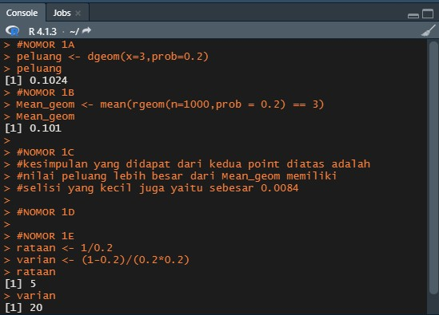
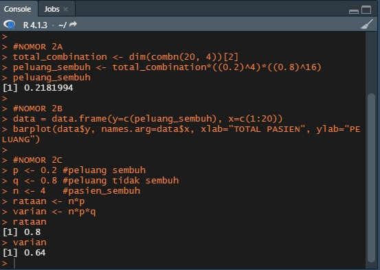
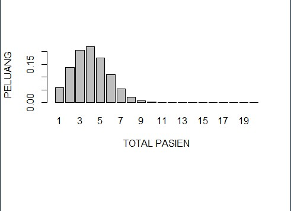
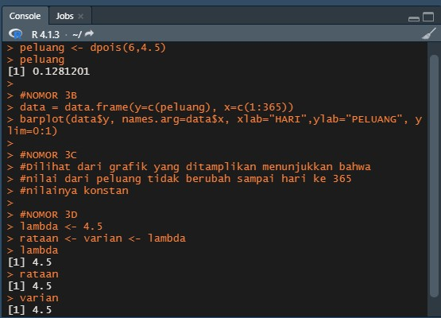
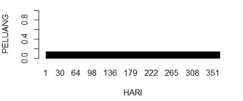
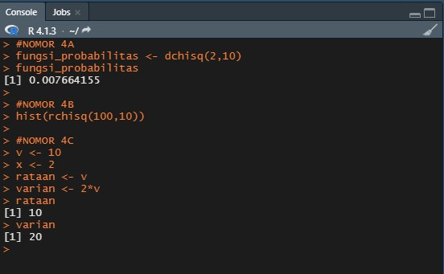
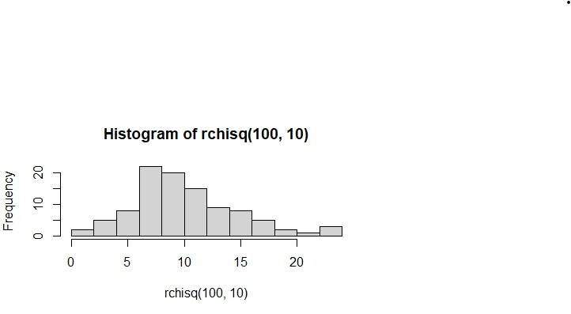
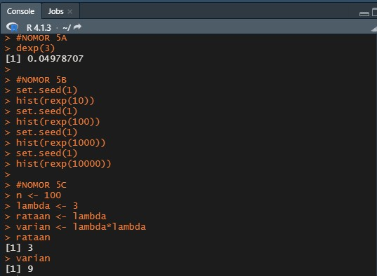
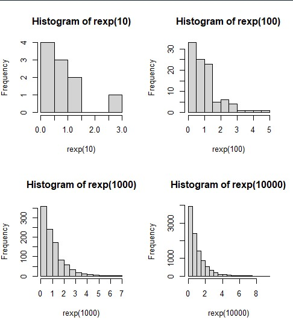
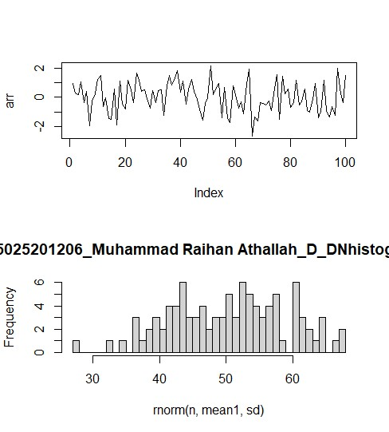

# PRAKTIKUM 1 PROBSTAT
### nama  : Muhammad Raihan Athallah
### nrp   : 5025201206
### kelas : Probstat D 

# Hasil Praktikum
## Soal 1
- Berapa peluang penyurvei bertemu x = 3 orang yang tidak menghadiri acara vaksinasi
sebelum keberhasilan pertama ketika p = 0,20 dari populasi menghadiri acara vaksinasi ?
(distribusi Geometrik)
- mean Distribusi Geometrik dengan 10000 data random , prob = 0,20 dimana distribusi
geometrik acak tersebut X = 3 ( distribusi geometrik acak () == 3 )
- Bandingkan Hasil poin a dan b , apa kesimpulan yang bisa didapatkan?
- Nilai Rataan (μ) dan Varian (σ²) dari Distribusi Geometrik

## Soal 2
- Peluang terdapat 4 pasien yang sembuh.
- Nilai Rataan (μ) dan Varian (σ²) dari DistribusiBinomial.

- Gambarkan grafik histogram berdasarkan kasus tersebut.

## Soal 3
- Berapa peluang bahwa 6 bayi akan lahir di rumah sakit ini besok?
- dan bandingkan hasil poin a dan b , Apa kesimpulan yang bisa didapatkan
- Nilai Rataan (μ) dan Varian (σ²) dari Distribusi Poisson

- simulasikan dan buatlah histogram kelahiran 6 bayi akan lahir di rumah sakit ini selama setahun (n = 365)

## Soal 4
- Fungsi Probabilitas dari Distribusi Chi-Square.
- Nilai Rataan (μ) dan Varian (σ²) dari DistribusiChi-Square.

- Histogram dari Distribusi Chi-Square dengan 100 data random.

## Soal 5
- Fungsi Probabilitas dari Distribusi Exponensial
- Nilai Rataan (μ) dan Varian (σ²) dari Distribusi Exponensial untuk n = 100 dan λ = 3
Petunjuk:
● Gunakan set.seed(1)
● Gunakan fungsi bawaan R

- Histogram dari Distribusi Exponensial untuk 10, 100, 1000 dan 10000 bilangan random

## Soal 6
- Fungsi Probabilitas dari Distribusi Normal P(X1 ≤ x ≤ X2), hitung Z-Score Nya dan plot
data generate randomnya dalam bentuk grafik. Petunjuk(gunakan fungsi plot()).
Keterangan :
X1 = Dibawah rata-rata
X2 = Diatas rata-rata
Contoh data :
11
1,2,4,2,6,3,10,11,5,3,6,8
rata-rata = 5.083333
X1 = 5
X2 = 6
- Nilai Varian (σ²) dari hasil generate random nilai Distribusi Normal.
- Generate Histogram dari Distribusi Normal dengan breaks 50 dan format penamaan:
NRP_Nama_Probstat_{Nama Kelas}_DNhistogram
Contoh :
312312312_Rola_Probstat_A_DNhistogram

